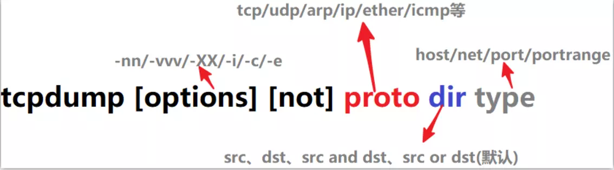

tcpdump - dump traffic on a network

tcpdump是一个用于截取网络分组，并输出分组内容的工具。凭借强大的功能和灵活的截取策略，使其成为类UNIX系统下用于网络分析和问题排查的首选工具

tcpdump 支持针对网络层、协议、主机、网络或端口的过滤，并提供and、or、not等逻辑语句来帮助你去掉无用的信息



## tcpdump的命令格式如下

```
tcpdump [ -AdDeflLnNOpqRStuUvxX ] [ -c count ]
[ -C file_size ] [ -F file ]
[ -i interface ] [ -m module ] [ -M secret ]
[ -r file ] [ -s snaplen ] [ -T type ] [ -w file ]
[ -W filecount ]
[ -E spi@ipaddr algo:secret,... ]
[ -y datalinktype ] [ -Z user ]
[ expression ]
```

## 命令行参数介绍

```
-A 以ASCII格式打印出所有分组，并将链路层的头最小化。
-c 在收到指定的数量的分组后，tcpdump就会停止。
-C 在将一个原始分组写入文件之前，检查文件当前的大小是否超过了参数file_size
中指定的大小。如果超过了指定大小，则关闭当前文件，然后在打开一个新的文件。参数 file_size
的单位是兆字节（是1,000,000字节，而不是1,048,576字节）。
-d 将匹配信息包的代码以人们能够理解的汇编格式给出。
-dd 将匹配信息包的代码以c语言程序段的格式给出。
-ddd 将匹配信息包的代码以十进制的形式给出。
-D 打印出系统中所有可以用tcpdump截包的网络接口。
-e 在输出行打印出数据链路层的头部信息。
-E 用spi@ipaddr algo:secret解密那些以addr作为地址，并且包含了安全参数索引值spi的IPsec ESP分组。
-f 将外部的Internet地址以数字的形式打印出来。
-F 从指定的文件中读取表达式，忽略命令行中给出的表达式。
-i 指定监听的网络接口。
-l 使标准输出变为缓冲行形式。
-L 列出网络接口的已知数据链路。
-m 从文件module中导入SMI MIB模块定义。该参数可以被使用多次，以导入多个MIB模块。
-M 如果tcp报文中存在TCP-MD5选项，则需要用secret作为共享的验证码用于验证TCP-MD5选选项摘要（详情可参考RFC 2385）。
-n 不把网络地址转换成名字。
-N 不输出主机名中的域名部分。例如，‘nic.ddn.mil‘只输出’nic‘。
-t 在输出的每一行不打印时间戳。
-O 不运行分组分组匹配（packet-matching）代码优化程序。
-P 不将网络接口设置成混杂模式。
-q 快速输出。只输出较少的协议信息。
-r 从指定的文件中读取包(这些包一般通过-w选项产生)。
-S 将tcp的序列号以绝对值形式输出，而不是相对值。
-s 从每个分组中读取最开始的snaplen个字节，而不是默认的68个字节。
-T 将监听到的包直接解释为指定的类型的报文，常见的类型有rpc远程过程调用）和snmp（简单网络管理协议；）。
-t 不在每一行中输出时间戳。
-tt 在每一行中输出非格式化的时间戳。
-ttt 输出本行和前面一行之间的时间差。
-tttt 在每一行中输出由date处理的默认格式的时间戳。
-u 输出未解码的NFS句柄。
-v 输出一个稍微详细的信息，例如在ip包中可以包括ttl和服务类型的信息。
-vv 输出详细的报文信息。
-w 直接将分组写入文件中，而不是不分析并打印出来。
-x 以16进制数形式显示每一个报文 (去掉链路层报头) . 可以显示较小的完整报文, 否则只显示snaplen个字节.
-xx 以16进制数形式显示每一个报文（包含链路层包头）。
-X 以16进制和ASCII码形式显示每个报文（去掉链路层报头）。
-XX 以16进制和ASCII吗形式显示每个报文（包含链路层报头）。
-y 设置tcpdump 捕获数据链路层协议类型
-Z 使tcpdump 放弃自己的超级权限(如果以root用户启动tcpdump, tcpdump将会有超级用户权限), 并把当前tcpdump的用户ID设置为user, 组ID设置为user首要所属组的ID
```


## 常用参数应用示例与应用场景介绍

### 默认启动

> [bash~]$ sudo tcpdump

tcpdump如果不加任何参数，启动后默认会监视第一个网络接口上所有流过的数据包。


### 观察指定接口的网络数据包

> [bash~]$ sudo tcpdump -i eth0

想知道本机都有那些网络接口，可以通过tcpdump -D命令查看。如果想监听所有的网络接口，只要把-i参数值改为any就可以了。即，-i any。


### 以ASCII码方式查看数据包

> [bash~]$ sudo tcpdump -A

web程序与其他服务通信多数支持以ASCII格式传输数据。如，向mysql服务端传输的sql语句就是以ASCII码形式进行传输。我们就可以使用-A参数查看传输的具体sql语句。


### 把数据写入指定文件

> [bash~]$  tcpdump -w /tmp/tp.log

数据写入指定文件后，方便使用其他数据包分析软件进行分析。如 wireshark。在后面，我们将涉及如何使用wireshark分析tcpdump的数据包。


### 设置读取数据包的长度

> [bash~]$  tcpdump -s 200

默认读取的长度比较短，如果需要查看的信息被截断了。可以指定此参数。


## 抓包过滤规则

tcpdump能够截获指定接口或任何接口的数据包，这取决于如何对tcpdump进行配置。缺省情况下tcpdump一般会显示任何从网络上截获的数据包，但通常这样的信息量过大，不利于分析。因此，tcpdump提供了使用表达式过滤报文条件，来对截获的数据包进行过滤，从而只显示符合特定需要的数据包。下面我们对tcpdump的表达式做下介绍。

表达式是一个正则表达式，tcpdump利用它作为过滤报文的条件，如果一个报文符合表达式的条件，则这个报文将会被捕获。如果没有给出任何条件，则网络上所有的信息包将会被截获。在表达式中一般有如下几种类型的关键字。

### 关于类型的关键字

主要包括host，port，net。

例如：

> tcpdump host 102.168.1.100

截获来自和发往主机102.168.1.100的所有报文数据。

> tcpdump net 192.168.1.0/24

截获来自和发送到网络地址为192.168.1.0/24的所有主机的报文数据，

> tcpdump port 23

截获所有从23号端口发出，和发往23号端口的报文数据。如果没有指定类型，缺省的类型是host.


### 确定传输方向的关键字

主要包括src , dst ,dst or src, dst and src ,这些关键字指明了传输的方向。

举例说明：

> tcpdump src host 102.168.1.100

截获来自主机 102.168.1.100的所有报文数据

> tcpdump dst net 192.168.1.0/24

截获发送到网络地址为192.168.1.0/24的所有主机的报文数据 。既可以是名字(存在/etc/networks中),也可以是网络号.
如果没有指明方向关键字，则缺省是src or dst关键字。


### 协议的关键字

主要包括ip,arp,rarp,tcp,udp等类型。关键字就是指明了监听的包的协议内容。如果没有指定任何协议，则tcpdump将会监听所有协议的信息包。

> tcpdump udp

截获所有udp协议的报文数据。


### 逻辑运算关键字

主要包括，取非运算是 ‘not ‘ ‘! ‘, 与运算是’and’,’&&’;或运算 是’or’ ,’││’；这些关键字可以组合起来构成强大的组合条件来满足人们的需要。

> tcpdump "dst host 192.168.1.100 and (port 80 or port 8080)"

截获所有发往主机192.168.1.100的80端口或者8080端口的报文数据。


### 其它

除了这上面几种类型的关键字之外，其他重要的关键字如下：portrange，gateway, broadcast,less,greater。

> tcpdump -n dst portrange 1-1023

截获目标端口在1和1023之间的所有报文数据。

> tcpdump greater 20

截获所有报文长度大于20的报文数据。


## 输出信息的基本格式

虽然tcpdump会根据指定参数的不同，输出结果有所差异，但是它基本的输出格式相同。

系统时间 来源主机.端口 > 目标主机.端口 数据包参数。

下面我们来看下集中典型的输出。

### 数据链路层头信息

> tcpdump -e host host2 and port 11211
>
> ......
>
> 16:49:57.940257 00:16:3e:00:00:2f (oui Unknown) > 00:16:3e:00:6c:fc (oui Unknown), ethertype IPv4 (0x0800), length 110: host1.41684 > host2.11211: P 1036863:1036907(44) ack 839113 win 115 <nop,nop,timestamp 1914224417 1914343362>
>
> ......

```
16:49:57 是时间。 格式为，小时:分:秒。
940257 为ID号。
00:16:3e:00:00:2f 发出数据包主机的mac地址。
oui Unknown 表面mac地址对应的oui（厂商代码）不能识别。
00:16:3e:00:6c:fc 数据包目标主机的mac地址。
ethertype IPv4 (0x0800) 以太网帧所携带的上层数据类型为IPv4。
110 是数据包的长度。
host1.41684 表示发送数据包的主机名是host1，端口是41684。
host2.11211 数据包目标地址主机的主机名是host2，接受数据包的端口是11211。
P 表示发送数据。
(44) 表示发送数据的长度是44个字节。
ack 839113 表示对序列号为839113的包进行响应。
win 115 表示发送的窗口大小为115。
```


### TCP包的输出信息

> tcpdump tcp port 11211
>
> ....
>
> 17:31:47.143178 IP host1.48232 > host2.11211: S 307816357:307816357(0) win 14600 <mss 1460,sackOK,timestamp 1916733618 0,nop,wscale 7>
>
> ....

```
17:31:47.143178 是时间
IP 是协议说明。
host1.48232 > 是发送端主机和端口。符号 > 表明数据的传输方向。
host2.11211 接收端的主机名和端口。
S flags是TCP包中的标志信息（S是SYN标志，F(FIN)，P(PUSH)，R(RST)，”.”(没有标记)）。
第五列 ata-seqno是数据包中的数据的顺序号。
第六列 ack是下次期望的顺序号。
第七列 window是接收缓存的窗口大小。
```


### UDP包的输出信息

用TCPDUMP捕获的UDP包的一般输出信息是：
route.port1 > ice.port2: udp lenth

> tcpdump udp
>
> ......
>
> 06:03:21.199876 IP v101081217.sqa.zmf.bo56.com.65535 > 224.7.3.1.entextxid: UDP, length 64
>
> ......


UDP十分简单，上面的输出行表明从主机ROUTE的port1端口发出的一个UDP数据包到主机ICE的port2端口，类型是UDP， 包的长度是lenth。


另外，为了让网络接口可以让tcpdump监听，所以执行tcpdump时网络接口会启动在“混杂模式（promiscuous）”，所以你会在 /var/log/messages里面看到很多的警告信息，通知你说你的网卡被设置成为混杂模式。别担心，那是正常的。至于更多的应用，请参考man tcpdump了。